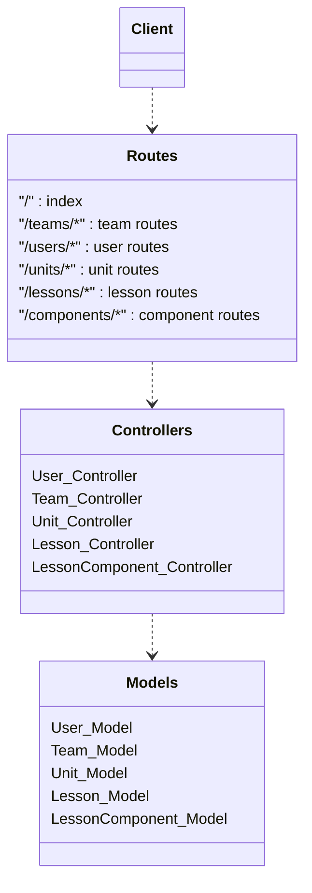
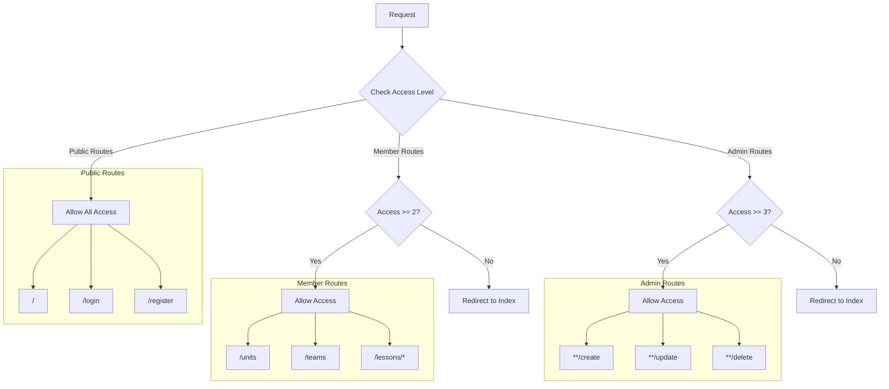
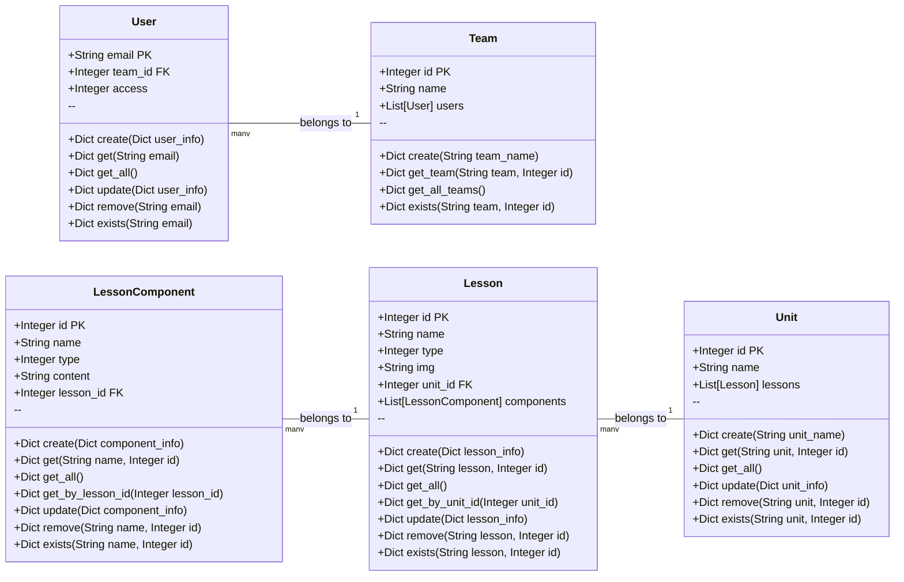
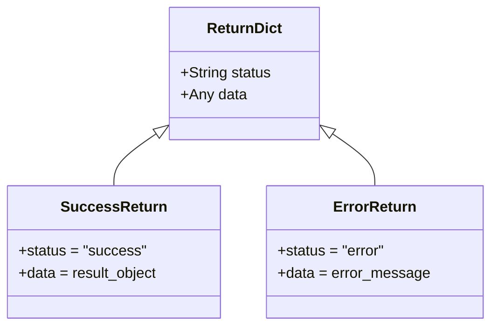
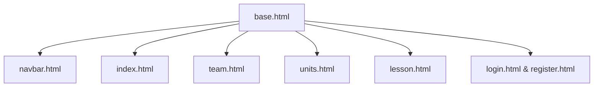

# Robotics Learning Management System

## Project Overview
A learning management system designed for robotics education. The system manages users, teams, learning units, lessons, and lesson components through a modular architecture using SQLAlchemy with SQLite storage.

## Technology Stack
- Backend: Python, Flask
- Database: SQLite with SQLAlchemy ORM
- Frontend: HTML, CSS
- Testing: pytest

## Project Structure

```
robosite/
├── controllers/           # HTTP request handlers and route logic
│   ├── User_Controller.py
│   ├── Team_Controller.py
│   ├── unit_Controller.py
│   ├── lesson_Controller.py
│   └── lesson_component_Controller.py
│
├── models/               # Database models and business logic
│   ├── database.py      # SQLAlchemy models and base configuration
│   ├── user_model.py
│   ├── team_model.py
│   ├── unit_model.py
│   ├── lesson_model.py
│   └── lesson_component_model.py
│
├── templates/            # Jinja2 HTML templates
│   ├── shared/          # Common template components
│   │   ├── base.html    # Base template with common structure
│   │   └── navbar.html  # Navigation component
│   ├── index.html
│   ├── login.html
│   ├── register.html
│   ├── team.html
│   ├── units.html
│   └── lesson.html
│
├── static/              # Static assets
│   └── css/
│       └── styles.css
│
├── tests/               # Test suite
│   ├── model_tests/    # Unit tests for models
│   ├── controller_tests/  # Unit tests for controllers
│   ├── test_data/     # Test fixtures and sample data
│   ├── __init__.py          
│   └── conftest.py    # pytest configuration and fixtures
│
├── data/               # SQLite database and JSON files
├── server.py          # Flask application entry point
└── requirements.txt   # Python dependencies
```

### Key Components

- **controllers/**: Implements the application's business logic and handles HTTP requests. Each controller corresponds to a specific model and handles CRUD operations through Flask routes.

- **models/**: Contains SQLAlchemy models representing database tables and their relationships. Each model implements data access methods and business logic for its respective entity.

- **templates/**: Jinja2 templates for rendering HTML pages. Uses a base template pattern with shared components for consistent layout and navigation.

- **static/**: Houses static assets like CSS files, JavaScript, and images.

- **tests/**: Organized test suite with separate directories for model and controller tests. Includes sample data and fixtures for testing.

- **data/**: Storage location for SQLite database file and JSON data files.

## Controllers

### Controller Architecture


### Access Control


### Controllers and Routes

#### User Controller
- Routes:
  - POST `/users/update`: Update user information (Admin only)
  - POST `/users/delete`: Delete user (Admin only)

- Access Control:
  - Updating/deleting users requires admin access (level 3)
  - User data is accessible to all authenticated users

#### Team Controller
- Routes:
  - GET `/teams`: View teams
  - POST `/teams/create`: Create new team (Admin only)
  - POST `/teams/update`: Update team (Admin only)

- Access Control:
  - Viewing teams requires member access (level 2)
  - Team management requires admin access (level 3)

#### Unit Controller
- Routes:
  - GET `/units`: View all units and lessons
  - POST `/units/create`: Create new unit (Admin only)
  - POST `/units/update`: Update unit (Admin only)
  - POST `/units/delete`: Delete unit (Admin only)
- Access Control:
  - Viewing units requires member access (level 2)
  - Unit management requires admin access (level 3)

#### Lesson Controller
- Routes:
  - GET `/lessons/<id>`: View specific lesson
  - POST `/lessons/create`: Create new lesson (Admin only)
  - POST `/lessons/update`: Update lesson (Admin only)
  - POST `/lessons/delete`: Delete lesson (Admin only)
- Access Control:
  - Viewing lessons requires member access (level 2)
  - Lesson management requires admin access (level 3)

#### LessonComponent Controller
- Routes:
  - GET `/lesson_components/<id>`: View component
  - POST `/lesson_components/create`: Create component (Admin only)
  - POST `/lesson_components/update`: Update component (Admin only)
  - POST `/lesson_components/delete`: Delete component (Admin only)
- Access Control:
  - Viewing components requires member access (level 2)
  - Component management requires admin access (level 3)

## Data Models

### Database Schema


### Common Return Format
All model methods that return a Dict follow this format:


### Access Levels
- 1: Guest (cannot submit assignments or edit)
- 2: Member (can submit assignments and are on a team)
- 3: Captain/Teacher (can edit and assign assignments)

### Model Methods

#### User_Model
- `initialize_DB(DB_name: str) -> None`: Initialize SQLite database connection
- `exists(email: str) -> bool`: Check if user exists
- `create(user_info: Dict) -> Dict[status, data]`: Create new user with validation
  - Required fields: email
  - Optional fields: team (default=2), access (default=1)
- `get(email: str) -> Dict[status, data]`: Retrieve user by email
- `get_all() -> Dict[status, List[user]]`: List all users
- `update(user_info: Dict) -> Dict[status, data]`: Update user information
- `remove(email: str) -> Dict[status, data]`: Delete user

#### Team_Model
- `initialize_DB(DB_name: str) -> None`: Initialize database connection
- `exists(team: Optional[str], id: Optional[int]) -> bool`: Check team existence
- `create(team_name: str) -> Dict[status, data]`: Create new team
- `get_team(team: Optional[str], id: Optional[int]) -> Dict[status, data]`: Get team by name or ID
- `get_all_teams() -> Dict[status, List[team]]`: List all teams

#### Unit_Model
- `initialize_DB(DB_name: str) -> None`: Initialize database connection
- `exists(unit: Optional[str], id: Optional[int]) -> bool`: Check unit existence
- `create(unit_name: str) -> Dict[status, data]`: Create new unit
- `get(unit: Optional[str], id: Optional[int]) -> Dict[status, data]`: Get unit by name or ID
- `get_all() -> Dict[status, List[unit]]`: List all units
- `update(unit_info: Dict) -> Dict[status, data]`: Update unit information
- `remove(unit: Optional[str], id: Optional[int]) -> Dict[status, data]`: Delete unit

#### Lesson_Model
- `initialize_DB(DB_name: str) -> None`: Initialize database connection
- `exists(lesson: Optional[str], id: Optional[int]) -> bool`: Check lesson existence
- `create(lesson_info: Dict) -> Dict[status, data]`: Create new lesson
  - Required fields: name, unit_id
  - Optional fields: type, img
- `get(lesson: Optional[str], id: Optional[int]) -> Dict[status, data]`: Get lesson by name or ID
- `get_all() -> Dict[status, List[lesson]]`: List all lessons
- `get_by_unit_id(unit_id: int) -> Dict[status, List[lesson]]`: Get lessons for a unit
- `update(lesson_info: Dict) -> Dict[status, data]`: Update lesson information
- `remove(lesson: Optional[str], id: Optional[int]) -> Dict[status, data]`: Delete lesson

#### Lesson_Component_Model
- `initialize_DB(DB_name: str) -> None`: Initialize database connection
- `exists(lesson_component: Optional[str], id: Optional[int]) -> bool`: Check component existence
- `create(component_info: Dict) -> Dict[status, data]`: Create new component
  - Required fields: name, lesson_id
  - Optional fields: type (default=1), content (default='{}')
- `get(lesson_component: Optional[str], id: Optional[int]) -> Dict[status, data]`: Get component by name or ID
- `get_all() -> Dict[status, List[component]]`: List all components
- `get_by_lesson_id(lesson_id: int) -> Dict[status, List[component]]`: Get components for a lesson
- `update(component_info: Dict) -> Dict[status, data]`: Update component information
- `remove(lesson_component: Optional[str], id: Optional[int]) -> Dict[status, data]`: Delete component


## HTML Templates

### Template Hierarchy


### Template Components

#### Base Template (base.html)
- Core HTML structure
- Bootstrap CSS/JS includes
- Flash message handling
- Common styling
- Navbar inclusion
- Content block for child templates

#### Navbar (navbar.html)
- Responsive navigation
- Dynamic menu based on user access level
- Login/Register links for guests
- Team/Unit navigation for members
- Admin controls for level 3 users

#### Auth Templates
1. login.html
   - Login form
   - Email/password inputs
   - Registration link
2. register.html
   - Registration form
   - Email/team/access level inputs
   - Login link

#### Content Templates
1. index.html
   - Welcome message
   - Feature overview
   - Quick access links based on user role
   - Statistics for admins

2. team.html
   - Team list/grid view
   - Team member management (admin)
   - Team statistics
   - Member assignments

3. units.html
   - Unit list/grid view
   - Associated lessons
   - Progress tracking
   - Unit management controls (admin)

4. lesson.html
   - Lesson content
   - Lesson components
   - Navigation between lessons
   - Component management (admin)
```

## Development Setup

1. Install required dependencies:
```bash
pip install -r requirements.txt
```

2. Initialize database:
```bash
python -c "from models.database import Base; from sqlalchemy import create_engine; engine = create_engine('sqlite:///data/robosite.db'); Base.metadata.create_all(engine)"
```

3. Set up and verify test environment:
```bash
# Show test collection and setup
python -m pytest tests/ --setup-show

# Test model layer
python -m pytest tests/model_tests/ -v

# Test controller layer
python -m pytest tests/controller_tests/ -v
```

## Running Tests

1. Run all tests:
```bash
python -m pytest tests/
```

2. Run specific test categories:
```bash
# Run all model tests
python -m pytest tests/model_tests/

# Run all controller tests
python -m pytest tests/controller_tests/

# Run specific model test
python -m pytest tests/model_tests/test_user_model.py

# Run specific controller test
python -m pytest tests/controller_tests/test_user_controller.py
```

3. Run tests with verbose output:
```bash
python -m pytest -v tests/
```

Note: The tests are organized into model_tests/ and controller_tests/ directories for better organization. All tests automatically handle test database setup and cleanup. Each test runs with a fresh SQLite test database that is removed after completion.

