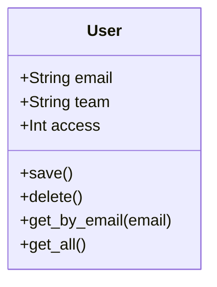
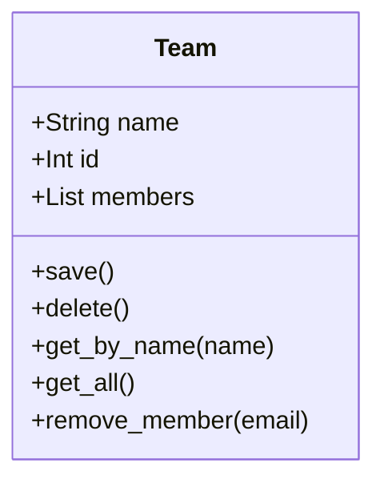
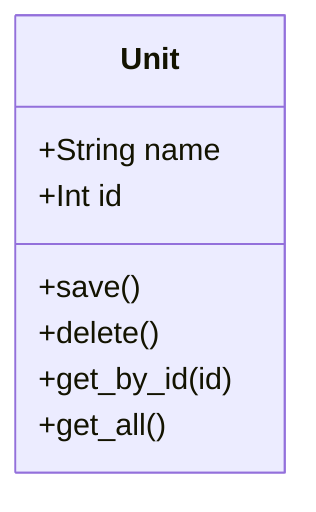
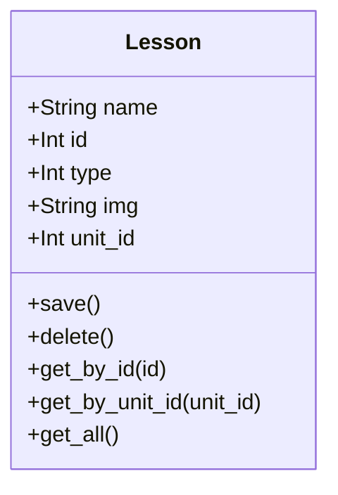
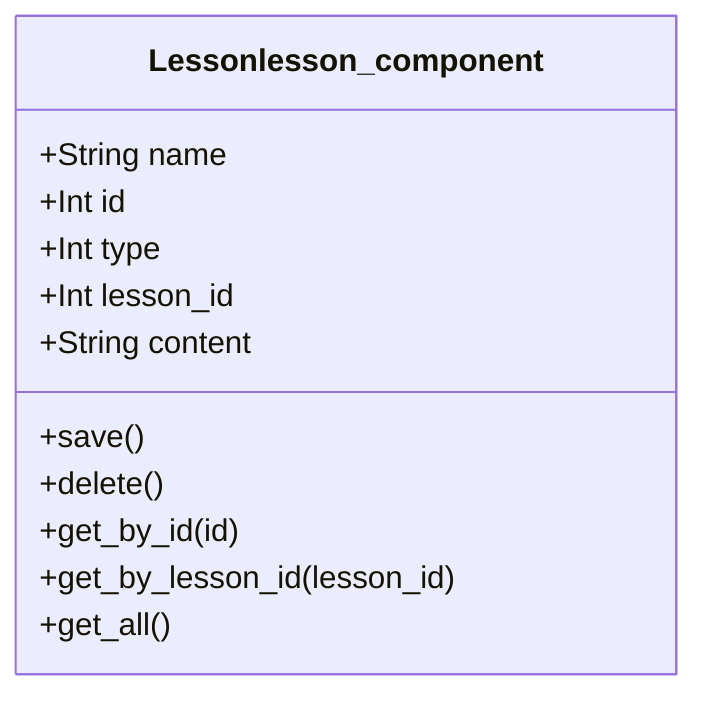

# Robotics Learning Management System

## Project Overview
A learning management system designed for robotics education. The system manages users, teams, learning units, lessons, and replacewithsmthhhelses through a modular data model with JSON-based storage.

## Folder Structure
```
robosite/
├── data/               # JSON data storage
│   ├── users.json
│   ├── teams.json
│   ├── units.json
│   ├── lessons.json
│   └── lesson_components.json
├── models/            # Data models
│   ├── user_model.py
│   ├── team_model.py
│   ├── unit_model.py
│   ├── lesson_model.py
│   └── lesson_component_model.py
├── templates/         # HTML templates
├── tests/            # Test files
│   ├── sample_data/  # Test data
│   └── test_*.py     # Unit tests
└── server.py         # Main application server
```

## Class Models

### User Model


### Team Model


### Unit Model


### Lesson Model


### replacewithsmthhhelse Model


## Running Unit Tests

1. Install required dependencies:
```bash
pip install pytest
```

2. Navigate to the project root directory:
```bash
cd robosite
```

3. Run all tests:
```bash
pytest tests/
```

4. Run specific test file:
```bash
pytest tests/test_user_model.py
```

5. Run tests with verbose output:
```bash
pytest -v tests/
```

Note: The tests automatically handle test data setup and cleanup. Each test starts with a fresh copy of the sample data and removes it after completion.