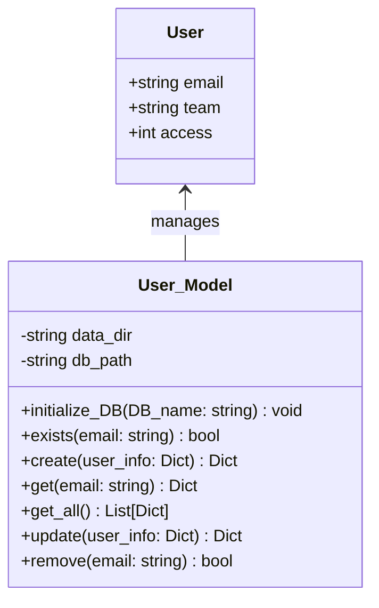

# Robosite

## Project Overview
Robosite is a comprehensive web application designed for robotics team management. It allows team captains to assign tasks to members, while members can submit their work and access resources. The platform provides a structured, educational environment similar to Khan Academy, organizing content into units and lessons.

### Key Features
- **User Role Management**: Different access levels (guest, member, captain/teacher)
- **Team Management**: Organize users into teams with dedicated captains
- **Educational Content**: Units and lessons with various components
- **Assignment System**: Create, assign, and submit assignments
- **Resource Sharing**: Post and access educational resources

## Architecture
Robosite is built with Python Flask following an MVC architecture:
- **Models**: Handle data persistence and business logic
- **Views**: Jinja2 templates for rendering HTML
- **Controllers**: Handle HTTP requests and business logic

Data is stored in JSON files within a `/data` directory for simplicity.

## Folder Structure
```
robosite/
├── data/                  # JSON database files
│   ├── users.json         # User information
│   ├── teams.json         # Team information
│   ├── units.json         # Unit information
│   ├── lessons.json       # Lesson information
│   └── lesson_components.json # Lesson component information
├── models/                # Model classes
│   ├── __init__.py
│   ├── User_Model.py      # User data management
│   ├── Team_Model.py      # Team data management
│   ├── Unit_Model.py      # Unit data management
│   ├── Lesson_Model.py    # Lesson data management
│   └── Lesson_Component_Model.py # Lesson component data management
├── controllers/           # Controller functions
│   ├── __init__.py
│   ├── users.py
│   ├── teams.py
│   ├── units.py
│   ├── lessons.py
│   └── assignments.py
├── templates/             # Jinja2 HTML templates
│   ├── shared/            # Shared components (navbar, footer)
│   │   ├── base.html      # Base template with shared structure
│   │   └── navbar.html    # Navigation bar
│   ├── index.html         # Home page
│   ├── login.html         # Login page
│   ├── to_do.html         # Task list page
│   ├── team.html          # Team management page
│   ├── units.html         # Units listing page
│   └── lesson.html        # Lesson display page
├── static/                # Static files (CSS, JS, images)
│   ├── css/
│   ├── js/
│   └── img/
├── tests/                 # Unit tests
│   ├── __init__.py
│   ├── test_user_model.py
│   └── test_team_model.py
├── server.py              # Main application file
└── README.md              # This file
```

## User Class Model Diagram



## Access Levels
1. **Guest (Level 1)**: Cannot submit assignments or edit content
2. **Member (Level 2)**: Can submit assignments and are part of a team
3. **Captain/Teacher (Level 3)**: Can edit assignments, assign tasks, and manage teams

## Teams
- **Phoenixes**: Team option 1
- **Pigeons**: Team option 2
- **Teacher**: Special team for instructors
- **None**: Default for users not assigned to a team

## Page Descriptions

### Home Page (index.html)
- Available to all access levels
- Basic information about the platform
- Login/register options

### To-Do Page (to_do.html)
- Available to users with access level 2+
- Lists all upcoming tasks sorted by due date
- Allows submission of completed work

### Team Page (team.html)
- Visible to access level 2+
- Shows all teams and their members
- Indicates member roles (captain, member)
- Level 3 users can manage team membership

### Units Page (units.html)
- Available to all access levels
- Lists all units with their respective lessons
- Level 3 users can edit unit information

### Lesson Page (lesson.html)
- Available to all access levels
- Displays lesson components with navigation
- Organized like Khan Academy with sidebar navigation
- Level 3 users can edit lesson content

## Running Unit Tests

To run the unit tests for Robosite:

1. Ensure you have pytest installed:
   ```bash
   pip install pytest
   ```

2. Navigate to the project root directory:
   ```bash
   cd path/to/robosite
   ```

3. Run the tests:
   ```bash
   pytest
   ```

4. For a specific test file:
   ```bash
   pytest tests/test_user_model.py
   ```

5. For verbose output:
   ```bash
   pytest -v
   ```

## Development Notes
- The application uses local JSON files for data storage for simplicity
- Each model handles its own CRUD operations on its respective JSON file
- Authentication should be implemented in a future version
- Consider implementing a proper database system for production use