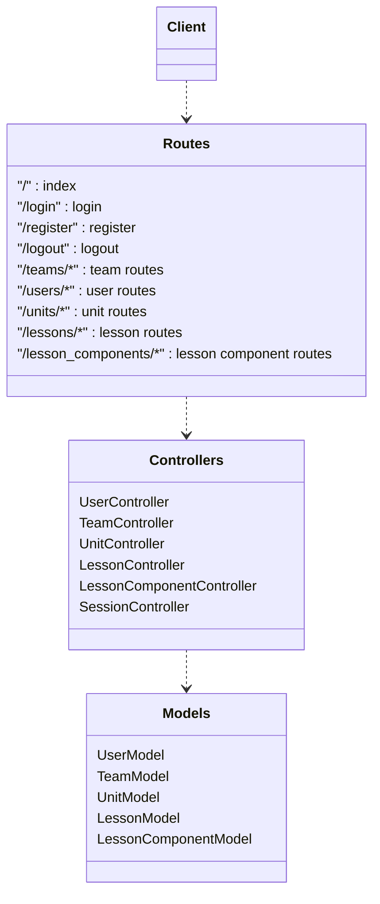
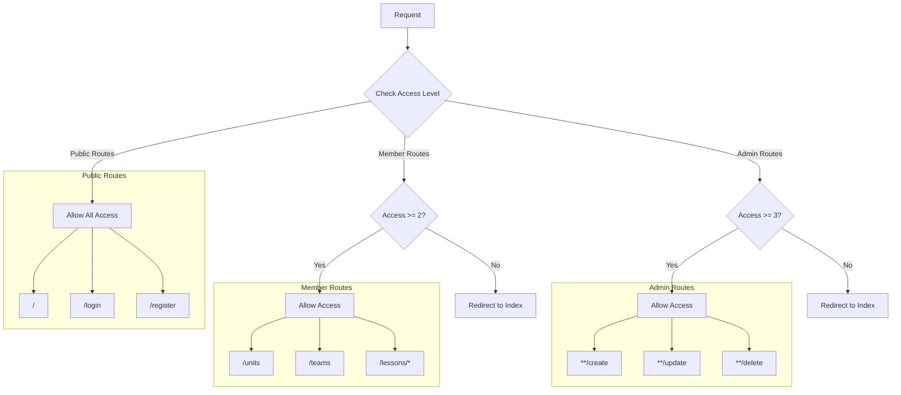
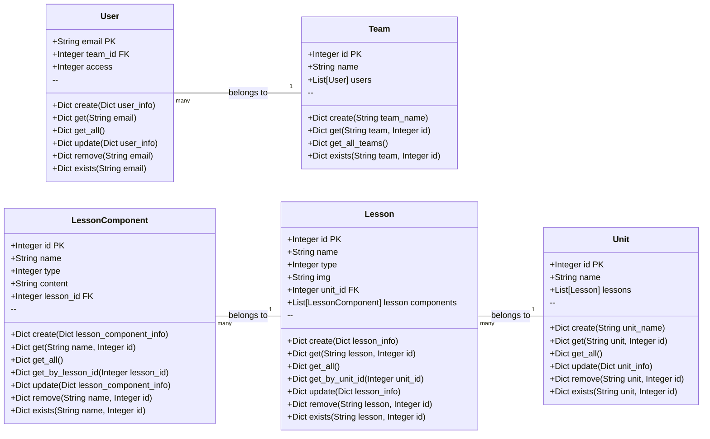
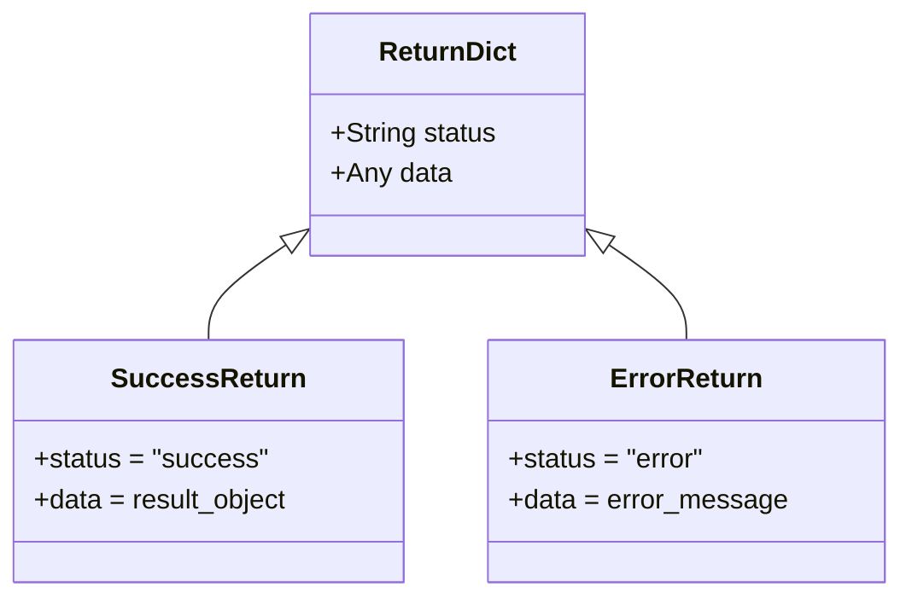
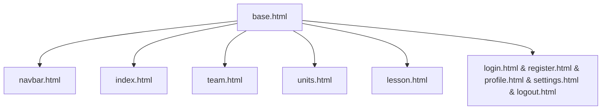
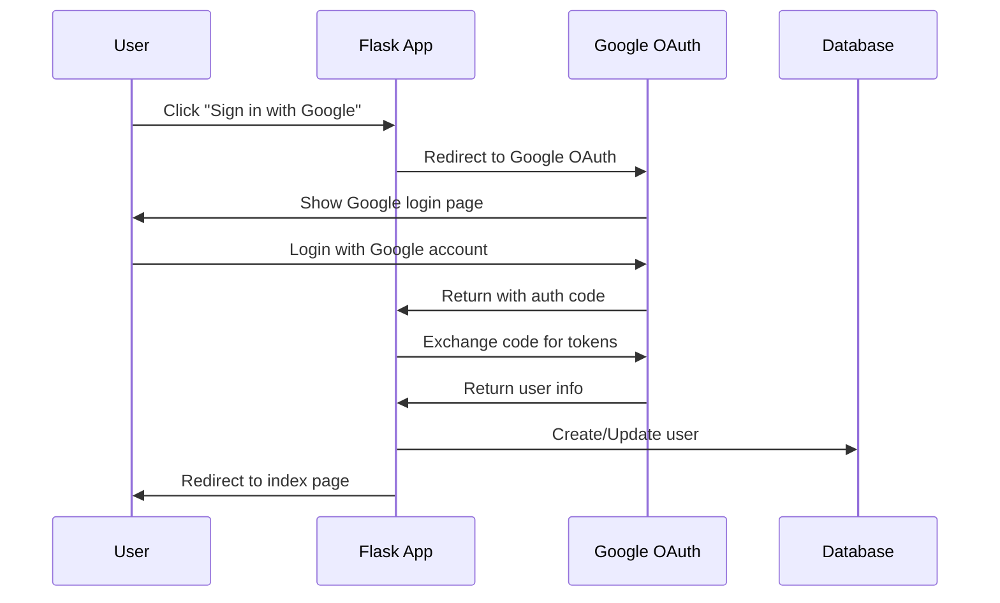

# Robotics Learning Management System

## Project Overview
A learning management system designed for robotics education. The system manages users, teams, learning units, lessons, and lesson components through a modular architecture using SQLAlchemy with SQLite storage.

## Technology Stack
- Backend: Python, Flask
- Database: SQLite with SQLAlchemy ORM
- Frontend: HTML, CSS
- Testing: pytest

## Project Structure

```
robosite/
├── controllers/           # HTTP request handlers and route logic
│   ├── User_Controller.py
│   ├── Team_Controller.py
│   ├── unit_Controller.py
│   ├── lesson_Controller.py
|   ├── session_Controller.py
│   └── lesson_component_Controller.py
│
├── models/               # Database models and business logic
│   ├── database.py      # SQLAlchemy models and base configuration
│   ├── user_model.py
│   ├── team_model.py
│   ├── unit_model.py
│   ├── lesson_model.py
│   └── lesson_component_model.py
│
├── templates/            # Jinja2 HTML templates
│   ├── shared/          # Common template components
│   │   ├── base.html    # Base template with common structure
│   │   └── navbar.html  # Navigation component
│   ├── index.html
│   ├── login.html
│   ├── register.html
│   ├── team.html
│   ├── units.html
│   └── lesson.html
│
├── static/              # Static assets
│   └── css/
│       └── styles.css
│
├── tests/               # Test suite
│   ├── model_tests/    # Unit tests for models
│   ├── controller_tests/  # Unit tests for controllers
│   ├── test_data/     # Test fixtures and sample data
│   ├── __init__.py          
│   └── conftest.py    # pytest configuration and fixtures
│
├── data/               # SQLite database and JSON files
├── server.py          # Flask application entry point
└── requirements.txt   # Python dependencies
```

### Key Components

- **controllers/**: Implements the application's business logic and handles HTTP requests. Each controller corresponds to a specific model and handles CRUD operations through Flask routes.

- **models/**: Contains SQLAlchemy models representing database tables and their relationships. Each model implements data access methods and business logic for its respective entity.

- **templates/**: Jinja2 templates for rendering HTML pages. Uses a base template pattern with shared template sections for consistent layout and navigation.

- **static/**: Houses static assets like CSS files, JavaScript, and images.

- **tests/**: Organized test suite with separate directories for model and controller tests. Includes sample data and fixtures for testing.

- **data/**: Storage location for SQLite database file and JSON data files.

## Controllers

### Controller Architecture


### Access Control


### Controllers and Routes

#### SessionController
- Methods:
  - `index()`: Render home page with current user context
- Routes:
  - GET `/`: Home page with dynamic content based on user access level
- Access Control:
  - Public access (all levels)
  - Shows different content based on user.access

#### AuthController
- Methods:
  - `login()`: Initiates Google OAuth flow
  - `callback()`: Handles OAuth callback and user creation
  - `logout()`: Clears session
  - `get_current_user()`: Returns authenticated user or default guest
- Routes:
  - GET `/auth/google`: Start OAuth flow
  - GET `/auth/google/callback`: Handle OAuth response
  - GET `/logout`: Logout user

#### UserController
- Methods:
  - `update()`: Update user info with OAuth data
  - `delete()`: Remove user by Google ID
- Access Control:
  - All methods require admin (level 3)

#### TeamController
- Methods:
  - `view()`: Show teams and members
  - `create()`: Create new team with name
  - `update()`: Update team name
- Access Control:
  - View requires member (level 2)
  - Create/Update require admin (level 3)

#### UnitController
- Methods:
  - `view()`: Show units and lessons
  - `create()`: Create unit with name
  - `update()`: Update unit name
  - `delete()`: Remove unit and lessons
- Access Control:
  - View requires member (level 2)
  - Create/Update/Delete require admin (level 3)

#### LessonController
- Methods:
  - `view(unit_id, lesson_id)`: Show lesson and components
  - `create()`: Create lesson with name, type, img
  - `update()`: Update lesson fields
  - `delete()`: Remove lesson and components
- Access Control:
  - View requires member (level 2)
  - Create/Update/Delete require admin (level 3)

#### LessonComponentController
- Methods:
  - `view(unit_id, lesson_id, component_id)`: Show component
  - `create()`: Create component with content
  - `update()`: Update component fields
  - `delete()`: Remove component
- Access Control:
  - View requires member (level 2)
  - Create/Update/Delete require admin (level 3)


#### Server Configuration
```python
# OAuth setup
from google.oauth2.credentials import Credentials
from google_auth_oauthlib.flow import Flow
from googleapiclient.discovery import build

# Required env vars
GOOGLE_CLIENT_ID = os.getenv('GOOGLE_CLIENT_ID')
GOOGLE_CLIENT_SECRET = os.getenv('GOOGLE_CLIENT_SECRET')
GOOGLE_REDIRECT_URI = os.getenv('GOOGLE_REDIRECT_URI')

# Routes
@app.route('/auth/google')
def login():
    return auth_controller.login()

@app.route('/auth/google/callback') 
def callback():
    return auth_controller.callback()
```

## Data Models

### Database Schema


### Common Return Format
All model methods that return a Dict follow this format:


### Access Levels
- 1: Guest (cannot submit assignments or edit)
- 2: Member (can submit assignments and are on a team)
- 3: Captain/Teacher (can edit and assign assignments)

### Model Methods

#### UserModel
- `initialize_DB(DB_name: str) -> None`: Initialize SQLite database connection
- `exists(email: str=None, google_id: str=None) -> bool`: Check if user exists
- `get(email: str=None, google_id: str=None) -> Dict[status, data]`: Retrieve user by email or google_id
- `get_all() -> Dict[status, List[user]]`: List all users
- `update(user_info: Dict) -> Dict[status, data]`: Update user information
- `remove(google_id: str) -> Dict[status, data]`: Delete user
- `create(user_info: Dict) -> Dict`: Create or update user from Google OAuth data
  - Required fields: google_id, name, email
  - Optional: team_id (default=2), access (default=2)

#### TeamModel
- `initialize_DB(DB_name: str) -> None`: Initialize database connection
- `exists(team: Optional[str], id: Optional[int]) -> bool`: Check team existence
- `create(team_name: str) -> Dict[status, data]`: Create new team
- `get(team: Optional[str], id: Optional[int]) -> Dict[status, data]`: Get team by name or ID
- `get_all_teams() -> Dict[status, List[team]]`: List all teams

#### UnitModel
- `initialize_DB(DB_name: str) -> None`: Initialize database connection
- `exists(unit: Optional[str], id: Optional[int]) -> bool`: Check unit existence
- `create(unit_name: str) -> Dict[status, data]`: Create new unit
- `get(unit: Optional[str], id: Optional[int]) -> Dict[status, data]`: Get unit by name or ID
- `get_all() -> Dict[status, List[unit]]`: List all units
- `update(unit_info: Dict) -> Dict[status, data]`: Update unit information
- `remove(unit: Optional[str], id: Optional[int]) -> Dict[status, data]`: Delete unit

#### LessonModel
- `initialize_DB(DB_name: str) -> None`: Initialize database connection
- `exists(lesson: Optional[str], id: Optional[int]) -> bool`: Check lesson existence
- `create(lesson_info: Dict) -> Dict[status, data]`: Create new lesson
  - Required fields: name, unit_id
  - Optional fields: type, img
- `get(lesson: Optional[str], id: Optional[int]) -> Dict[status, data]`: Get lesson by name or ID
- `get_all() -> Dict[status, List[lesson]]`: List all lessons
- `get_by_unit_id(unit_id: int) -> Dict[status, List[lesson]]`: Get lessons for a unit
- `update(lesson_info: Dict) -> Dict[status, data]`: Update lesson information
- `remove(lesson: Optional[str], id: Optional[int]) -> Dict[status, data]`: Delete lesson

#### LessonComponentModel
- `initialize_DB(DB_name: str) -> None`: Initialize database connection
- `exists(lesson_component: Optional[str], id: Optional[int]) -> bool`: Check lesson component existence
- `create(lesson_component_info: Dict) -> Dict[status, data]`: Create new lesson component
  - Required fields: name, lesson_id
  - Optional fields: type (default=1), content (default='{}')
- `get(lesson_component: Optional[str], id: Optional[int]) -> Dict[status, data]`: Get lesson component by name or ID
- `get_all() -> Dict[status, List[lesson_component]]`: List all lesson components
- `get_by_lesson_id(lesson_id: int) -> Dict[status, List[lesson_component]]`: Get lesson components for a lesson
- `update(lesson_component_info: Dict) -> Dict[status, data]`: Update lesson_component information
- `remove(lesson_component: Optional[str], id: Optional[int]) -> Dict[status, data]`: Delete lesson component


## HTML Templates

### Template Hierarchy


### Template Components

#### Base Template (base.html)
- Core HTML structure
- Bootstrap CSS/JS includes
- Flash message handling
- Common styling
- Navbar inclusion
- Content block for child templates

#### Navbar (navbar.html)
- Responsive navigation
- Dynamic menu based on user access level
- Login/Register links for guests
- Team/Unit navigation for members
- Admin controls for level 3 users

#### Auth Templates
1. login.html
   - Login form
   - Email/password inputs
   - Registration link
2. register.html
   - Registration form
   - Email/team/access level inputs
   - Login link
3. profile.html
   - User profile information
4. settings.html
   - User settings form
5. logout.html
   - Logout confirmation page
   - Link to return to the home page

#### Content Templates
1. index.html
   - Welcome message
   - Feature overview
   - Quick access links based on user role

2. team.html
   - Team list/grid view
   - Team member management (admin)
   - Team statistics
   - Member assignments (lessons that members need to complete)

3. units.html
   - Unit list/grid view
   - Associated lessons
   - Progress tracking
   - Unit management controls (admin)

4. lesson.html
   - Lesson content
   - Lesson components
   - Navigation between lessons
   - Component management (admin)
```

## Development Setup

1. Install required dependencies:
```bash
pip install -r requirements.txt
```

2. Initialize database:
```bash
python -c "from models.database import Base; from sqlalchemy import create_engine; engine = create_engine('sqlite:///data/robosite.db'); Base.metadata.create_all(engine)"
```

3. Enable OAuth for local development:
```bash
# For Windows CMD
set OAUTHLIB_INSECURE_TRANSPORT=1

# For PowerShell
$env:OAUTHLIB_INSECURE_TRANSPORT = "1"

# For Linux/Mac
export OAUTHLIB_INSECURE_TRANSPORT=1
```

4. Set up and verify test environment:
```bash
# Show test collection and setup
python -m pytest tests/ --setup-show

# Test model layer
python -m pytest tests/model_tests/ -v

# Test controller layer
python -m pytest tests/controller_tests/ -v
```

## Running Tests

1. Run all tests:
```bash
python -m pytest tests/
```

2. Run specific test categories:
```bash
# Run all model tests
python -m pytest tests/model_tests/

# Run all controller tests
python -m pytest tests/controller_tests/

# Run specific session controller test
python -m pytest tests/controller_tests/test_session_controller.py

# Run specific model test
python -m pytest tests/model_tests/test_user_model.py

# Run specific controller test
python -m pytest tests/controller_tests/test_user_controller.py
```

3. Run tests with verbose output:
```bash
python -m pytest -v tests/
```

Note: The tests are organized into model_tests/ and controller_tests/ directories for better organization. All tests automatically handle test database setup and cleanup. Each test runs with a fresh SQLite test database that is removed after completion.

## Authentication

### Google OAuth Integration


### OAuth Configuration
Required environment variables:
```
GOOGLE_CLIENT_ID=your_client_id
GOOGLE_CLIENT_SECRET=your_client_secret
GOOGLE_REDIRECT_URI=http://localhost:5000/auth/google/callback

# For local development only, to allow OAuth over HTTP instead of HTTPS
OAUTHLIB_INSECURE_TRANSPORT=1
```

> **Note for Development**: Google OAuth typically requires HTTPS, but for local development on localhost, 
> setting the `OAUTHLIB_INSECURE_TRANSPORT` environment variable to `1` allows using HTTP. This is already
> configured in the server.py file, but can also be set manually as shown above.

### AuthController Methods
- `login()`: Initiates Google OAuth flow
- `callback()`: Handles OAuth callback and user creation
- `logout()`: Clears session and logs out user
- `get_current_user()`: Returns current authenticated user

### Current Routes

```python
# Public Routes
@app.route('/')                     # Home page
@app.route('/auth/google')          # Start Google OAuth flow
@app.route('/auth/google/callback') # Handle OAuth callback
@app.route('/logout')               # Logout user

# Team Routes (Member+ Access)
GET '/teams'              # View teams
POST '/teams/create'      # Create new team (Admin)
POST '/teams/update'      # Update team (Admin)

# User Routes (Admin Only)
POST '/users/update'      # Update user information
POST '/users/delete'      # Delete user

# Unit Routes (Member+ Access)
GET '/units'             # View all units
POST '/units/create'     # Create new unit (Admin)
POST '/units/update'     # Update unit (Admin)
POST '/units/delete'     # Delete unit (Admin)

# Lesson Routes (Member+ Access)
GET '/lessons/<unit_id>/<lesson_id>'  # View lesson
POST '/lessons/create'                # Create lesson (Admin)
POST '/lessons/update'                # Update lesson (Admin)
POST '/lessons/delete'                # Delete lesson (Admin)

# Lesson Component Routes (Member+ Access)
GET '/lessons/<unit_id>/<lesson_id>/<lesson_component_id>'  # View component
POST '/lesson_components/create'                            # Create component (Admin)
POST '/lesson_components/update'                            # Update component (Admin)
POST '/lesson_components/delete'                            # Delete component (Admin)
```

#### Access Control Rules
- Public Routes: No authentication required
- Member Routes: Requires access level >= 2
- Admin Routes: Requires access level = 3

#### Middleware Protection
All routes except public routes are protected by the `check_access` middleware which:
1. Validates user authentication
2. Checks required access level
3. Redirects unauthorized access to index with error message

